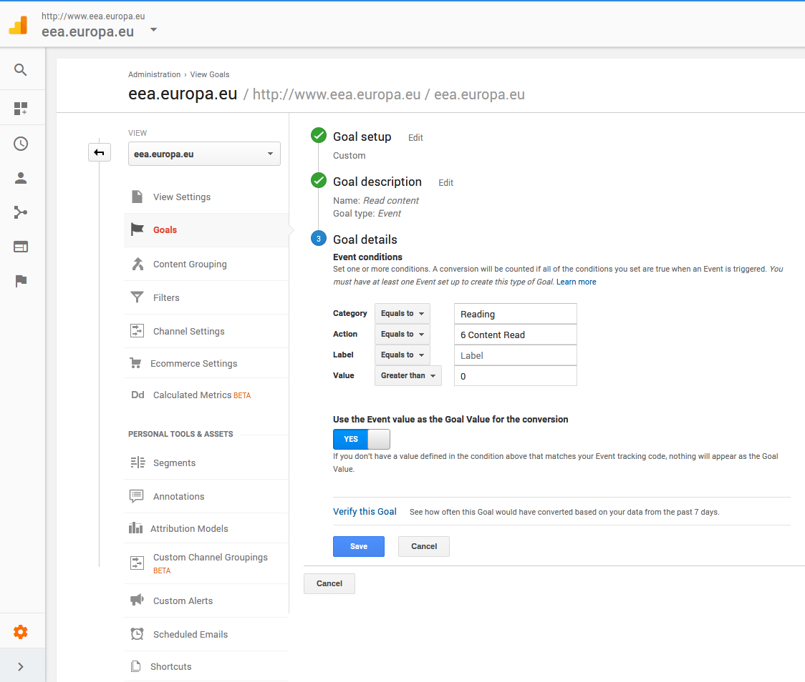
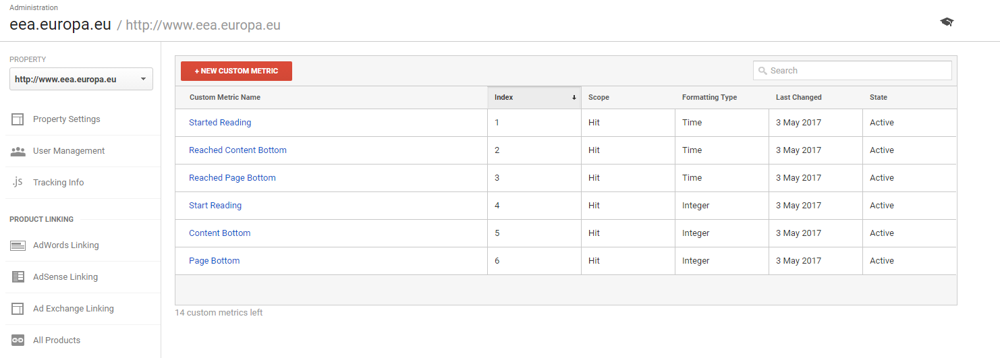
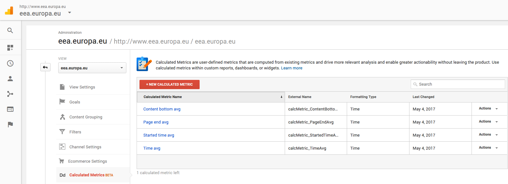
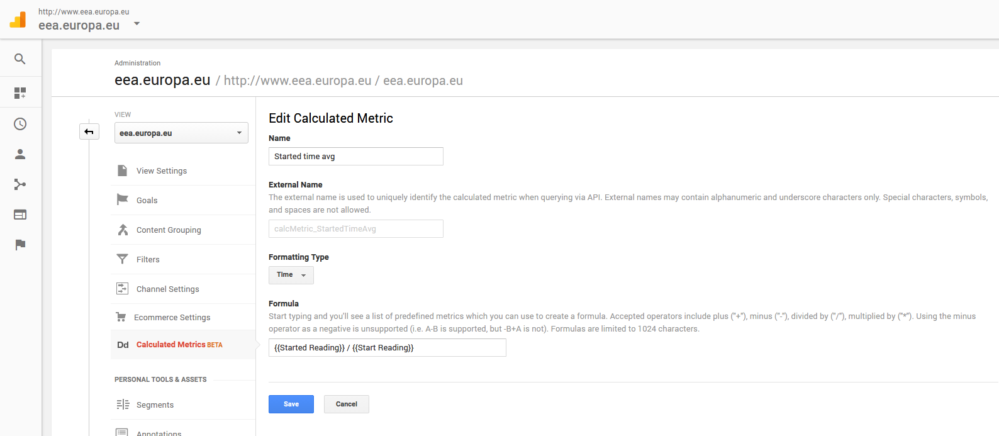
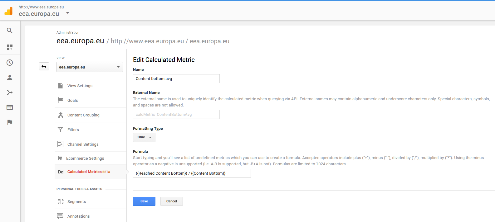
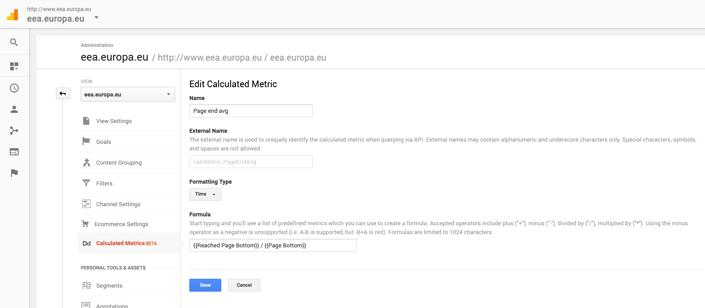
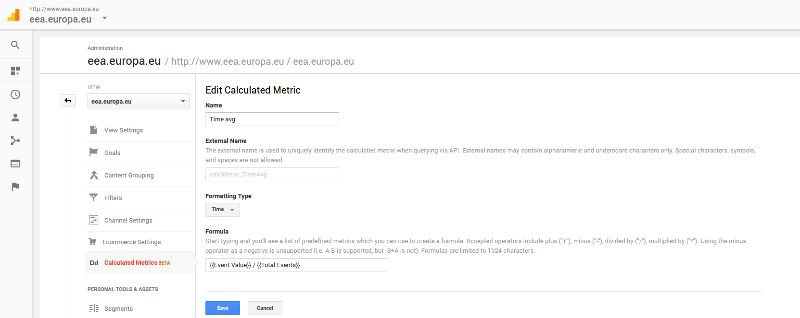
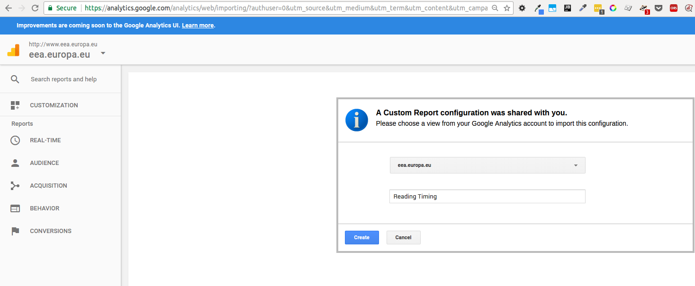
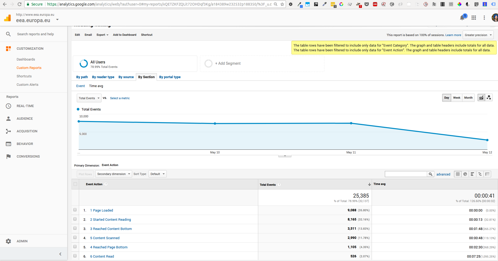
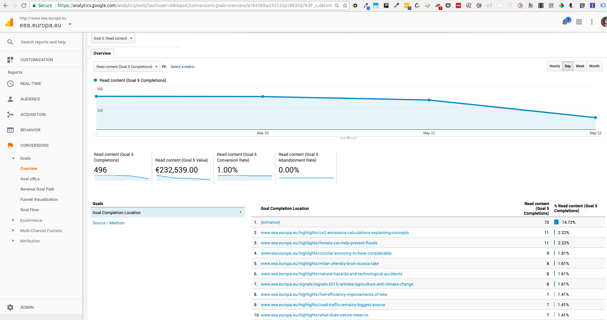

Table of Contents
=================

   * [Quick User Guide - How to add screen time analytics](#quick-user-guide---how-to-add-screen-time-analytics)
      * [Aim of this document](#aim-of-this-document)
      * [Steps to follow](#steps-to-follow)
      * [Google analytics configuration](#google-analytics-configuration)

# Quick User Guide - How to add screen time analytics

## Aim of this document

This document is targeted to **IT web developers** and **Web analytics users** for the web integration of the EEA google analytics plugin. The plugin introduces more advanced and precise way of measuring reading/usage score of Web content than the default Google Analytics provides. It will tell you exactly **how many are really reading your web content** and **how many are just scanners or looking around**. 

Contact Antonio De Marinis for more details.

## Steps to follow

Who: Web developer. 

The following steps should be performed in order to have screentime analytics tracking with Google Analytics: 
1. Install or update EEA Jquery to the latest version available
1. Add within a javascript a call to the jQuery plugin with the context set to the content area you want to track
  ex: <pre>
               $("#content-core").screentimeAnalytics();
      </pre>
 See the [github page](https://github.com/collective/eea.jquery/blob/master/eea/jquery/plugins/eea_screentimeanalytics/eea_screentimeanalytics.js#L633) for parameters which you can pass in case you want to modify the behaviour of the script
ex:
 <pre>
      $("#content-core").screentimeAnalytics({debug: true});
 </pre>
 in case you want to get console information instead of sending events to google
1. Configure google analytics to record the metrics given by the javascript as described in the next section

## Google analytics configuration

Who: Google Analytics Administrator. 

1. Create a new **goal**: 

1. Create the following **Custom metrics**:

1. Create the following **Calculated metrics** see individual metric bellow:

1. Configure **Started time avg** custom metric:

1. Configure **Content bottom avg** custom metric:

1. Configure **Page end avg** custom metric:

1. Configure **Time avg** custom metric:

1. Clink to import the **["Reading time custom report"](https://analytics.google.com/analytics/web/template?uid=5KK7hlW5R_-dv3o8_1ixpg)** as seen bellow:

After a few days you can see several reports such as the following

Or you can check from the goals page and see how many conversions you had for the goal of the page being read

